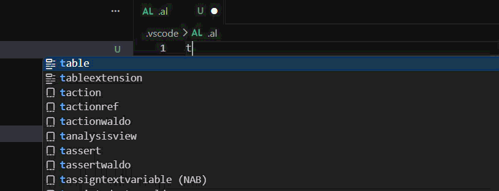
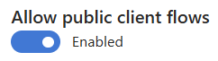
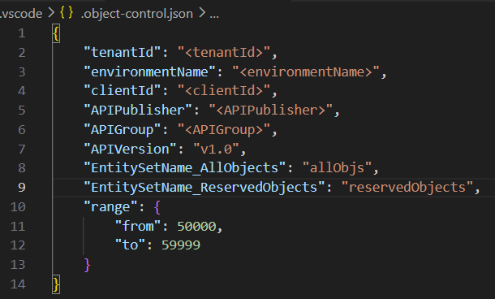

# AL Object Control
 **Are you tired of manually controlling your Object IDs in AL Development? Then this extension is for you!**

With AL Object Control, you can easily manage your Object IDs. This extension will save you time and make your development process smoother. Try it out and see the difference it can make in your AL Development workflow!

## Features

When creating a new AL Object just hit `Ctrl+Space` to suggest the next Object ID.

## Requirements

For this extension to work, you need to have: 
- An exposed `AllObj`(standard table) API that returns all the objects in your tenant. 
    - The available fields should be `ObjectType` and `ObjectID`.
    - Must be a Page API with `Read` permissions.
- An exposed `ReservedObjects` (custom table) API that returns all the reserved objects in your tenant. 
    - The available fields should be `ObjectType`, `ObjectID` and `SystemCreatedAt`.
    - Must be a Page API with `Read`, `Insert` and `Delete` permissions.
- An Azure App Registration for the Business Central environment
    - This extension uses **Authorization Code Flow** to authenticate the user. So the App Registration must have a redirect URI of `http://localhost`
    - 
    - 

## Extension Settings

### Comands
* `AL Object Control: Create Config File`: Create a .json configuration file inside .vscode folder.

    

* `AL Object Control: Clear Cache`: Clears cached JWT.

## Release Notes

### 1.0.0

Go Live! Initial release of AL Object Control extension.

**Enjoy!**